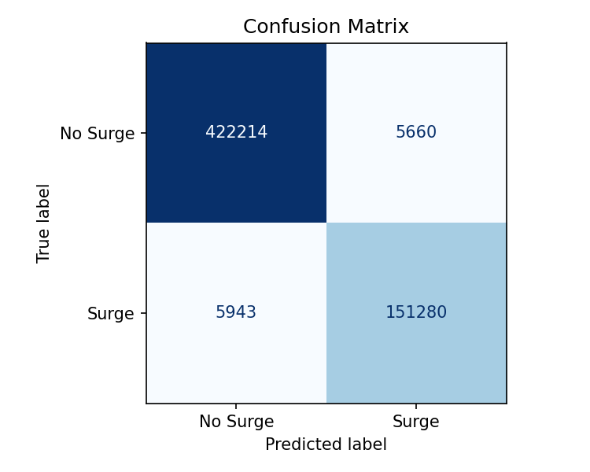
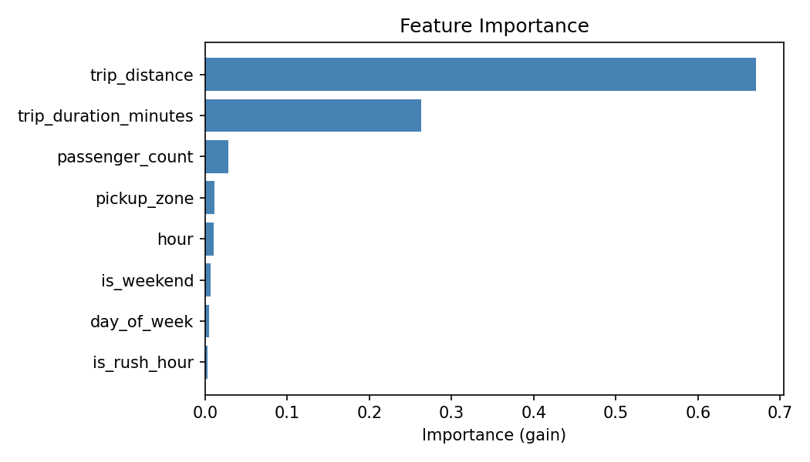

# Ride Surge Pricing Predictor

Predicts whether a NYC taxi trip will be a "surge" fare using XGBoost on TLC yellow taxi data.

## Setup

```bash
python -m venv .venv
source .venv/bin/activate
pip install -r requirements.txt
```

## How to run

### 1. Download data
```bash
python src/ingest.py
```
Downloads January 2024 NYC TLC yellow taxi data (~50 MB) to `data/raw.parquet` and prints basic stats.

### 2. Explore data
```bash
jupyter notebook notebooks/01_eda.ipynb
```
Runs EDA: hourly demand, day-of-week demand, top pickup zones, and surge hour detection.

### 3. Train the model
```bash
cd src && python train.py
```
Engineers features, trains XGBoost, prints accuracy + F1, saves model to `models/surge_model.pkl`.

## Model approach

| Step | Detail |
|------|--------|
| Target | `surge_label` = 1 if `fare_amount > 1.5 × median fare`, else 0 |
| Features | hour, day of week, is_weekend, is_rush_hour, pickup zone, trip duration, distance, passenger count |
| Algorithm | XGBoost classifier (200 trees, depth 6, lr 0.1) |
| Split | 80/20 train/test, stratified |
| Metrics | Accuracy, F1 score |

## Results

The XGBoost model was evaluated on a held-out 20% test split (stratified).

| Metric   | Score  |
|----------|--------|
| Accuracy | **98.02%** |
| F1 Score | **96.31%** |

### Confusion Matrix



### Feature Importance



`trip_duration_minutes` and `trip_distance` are the strongest predictors of surge fares, followed by time-of-day features (`hour`, `is_rush_hour`).

## Project structure

```
surge-predictor/
├── data/            # Raw parquet data (git-ignored)
├── models/          # Saved .pkl models (git-ignored)
├── notebooks/       # Jupyter EDA notebooks
│   └── 01_eda.ipynb
├── reports/         # Generated charts (confusion matrix, feature importance)
├── src/
│   ├── ingest.py    # Download + inspect raw data
│   ├── features.py  # Feature engineering
│   ├── train.py     # Model training + evaluation
│   ├── evaluate.py  # Generate reports/ charts
│   └── predict.py   # Single-trip surge probability inference
├── tests/           # pytest unit tests
├── requirements.txt
└── CLAUDE.md
```
